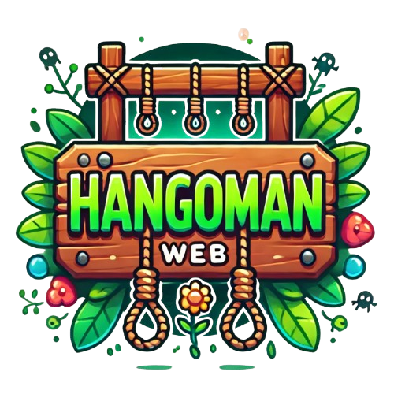

# HanGOman Web

***

## Introduction au projet

Le but du projet était de recréer le jeu du pendu en utilisant la librairie http de Go pour créer un serveur web et donc, une application web, mais également de réutiliser comme base, le projet précédent : ``hangman-classic``

Le jeu du pendu consiste à deviner un mot en proposant des lettres, une par une. Pour chaque mauvaise lettre, une partie d'un dessin (souvent un pendu) est ajoutée. Le but est de trouver le mot avant que le dessin soit complété.

## Prérequis
***

Afin de pouvoir faire tourner le jeu, et notamment le serveur, vous devrez installer le compilateur Go.
Vous pouvez le télécharger sur le site officiel de Golang ci-dessous :   
<a href = "https://go.dev/dl/">Lien vers le page de téléchargement du compilateur</a>

## Comment jouer 
***

Pour démarrer le serveur, il vous suffit de lancer le fichier ``main.go`` présent dans le dossier ``/cmd`` 

Pour cela : 

* Lancez un invite de commande et rendez-vous dans le fichier ``/hangman-web``.   
Une fois dedans, lancez la commande ``go run ./cmd``.
* Attendez quelques secondes et si deux lignes de texte s'affichent dans le terminal contenant ``The http server is starting.`` et ``Started on port :3000`` précédé de la date et de l'heure, rendez-vous sur votre navigateur à l'adresse ``localhost:3000`` ou depuis un autre appareil présent sur votre réseau en entrant ``http://[votre adresse ip]:3000``.

Vous allez vous retrouver sur la page principale du jeu :  
3 boutons y sont présents : 

* Le bouton jouer qui permet de lancer une partie (il vous sera demandé d'entrer votre pseudonyme et de choisir une difficulté).
* Le bouton comment jouer qui permet d'ouvrir une page avec un court explicatif des règles du jeu du pendu.
* Le bouton tableau des scores qui permet comme son nom l'indique, d'accéder au leaderboard (celui-ci sera vide si aucune partie n'a été finie depuis le redémarrage du serveur).

En jeu, vous aurez deux façons de choisir une lettre : via le clavier visuel ou via la barre de saisie (où vous pouvez y entrer un mot entier).

Si vous entrez une lettre qui n'est pas présente dans le mot à trouver, **un essai** vous est retiré. 
Si vous entrez un mot qui n'est pas celui à trouver, vous perdez **deux essais**.

En jeu, vous souhaitez rejouer ou retourner au menu principal, cliquez sur le menu pause en haut à droite et cliquez sur le bouton correspondant.

## Implémentation
***

### Architecture Générale
Le projet Hangman est structuré autour d'un serveur web développé en Go, utilisant les packages standard net/http et html/template pour la gestion des routes et du rendu des templates.
### Composants Principaux
##### Serveur Web

* Démarré par la fonction Init_Server()
* Écoute sur le port :3000
* Utilise http.ServeMux pour le routage
* Sert les fichiers statiques du dossier front-end

##### Routes Principales

1. ``/`` (Accueil)

* Gère la configuration initiale du jeu
* Permet de saisir un pseudo et choisir une difficulté

2. ``/game``

* Implémente la logique principale du jeu Hangman
* Gère les interactions du joueur
* Vérifie le statut du jeu (en cours, gagné, perdu)

3. ``/Win-Lose``

* Affiche l'écran de victoire ou de défaite
* Permet de rejouer ou retourner au menu principal

4. ``/leaderboard``

* Affiche le classement des joueurs

### Gestion du Jeu
##### Contexte de l'Application

* Utilise une structure ``AppContext`` pour stocker les données du jeu
* Les données sont conservées dans ``structs.HangManData``

##### Principales Fonctionnalités

* Initialisation du jeu (``game.Init()``)
* Insertion des caractères (``game.InsertChar()``)
* Vérification du statut du jeu (``game.StatusGame()``)

##### Gestion du Leaderboard

* Ajout des joueurs au classement via ``leaderboard.AddPlayerToLeaderBoard()``
* Récupération du classement avec ``leaderboard.GetLeaderBoard()``

##### Gestion des Templates

* Utilisation de ``html/template`` pour le rendu dynamique
* Templates stockés dans le dossier ``front-end``

    * ``index.gohtml``
    * ``game.gohtml``
    * ``win-lose.gohtml``
    * ``leaderboard.gohtml``

##### Gestion des Erreurs

* Logs des erreurs avec le package ``log``
* Gestion des redirections en cas d'erreur
* Vérifications des entrées utilisateur

##### Technologies Utilisées

* Langage : Go
* Bibliothèques principales :

    * ``net/http``
    * ``html/template``
    * ``log``

* Frontend : Templates Go HTML
* Style : CSS personnalisé

## Liens importants
***
<a href="https://trello.com/invite/b/673b3d04a761fd9d24a03b43/ATTI15afb18bf9827887604f516a7185c86785E7B7E0/hangman-web">Lien vers le trello</a>  
<a href="https://ytrack.learn.ynov.com/git/cnoah/hangman-web.git">Lien vers le dépot Gitea</a>